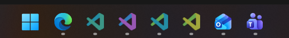

# Workspace Color Icons

**ALL VIBE CODED, USE AT YOUR OWN RISK**



A dependency-free Windows watcher that gives each VS Code window a deterministic
color-tinted VS Code icon based on its workspace identity. For remote windows,
the identity includes the Codespace, Dev Container, SSH, WSL, or Tunnel name, so
two Codespaces opened on folders with the same name receive different colors.
Icons are extracted from the installed VS Code executable at the current
window's native DPI instead of resizing a low-resolution bitmap.
Colors come from a curated eight-color categorical palette. It favors clear
separation between hue families over multiple similar shades, with only one
green family. Each workspace
uses a primary hue plus a blend toward one of its neighboring hues on the light
and dark faces of the VS Code logo. The watcher provides 64 combinations and
resolves hash collisions as windows appear, while avoiding clashing pairs such
as red and green. The `workspacePalette` array near the top of the script can be
edited to use a different set of hex colors.

Use in combination with utilities that let you un-group taskbar buttons, such as
[Start11](https://www.stardock.com/products/start11/) and [Windhawk disable grouping mod](https://windhawk.net/mods/taskbar-grouping).

## Install and run

From PowerShell:

```powershell
Set-ExecutionPolicy -Scope Process Bypass
.\WorkspaceColorIcons.ps1 -Install
```

This starts the watcher hidden and adds it to the current user's Startup folder.
Only one watcher can run at a time.

To run it in the current PowerShell window without installing:

```powershell
.\WorkspaceColorIcons.ps1
```

Press `Ctrl+C` to stop it.

To stop it and remove it from Startup:

```powershell
.\WorkspaceColorIcons.ps1 -Uninstall
```

The watcher checks visible VS Code and VS Code Insiders windows every 1.5 seconds.
It reads the workspace name from VS Code's default window title, so a heavily
customized `window.title` setting must still end with the workspace name and the
VS Code application name.

Windows may group VS Code windows into one taskbar button. The colored icon is
most useful with taskbar labels or ungrouped buttons enabled in Windows taskbar
settings.
